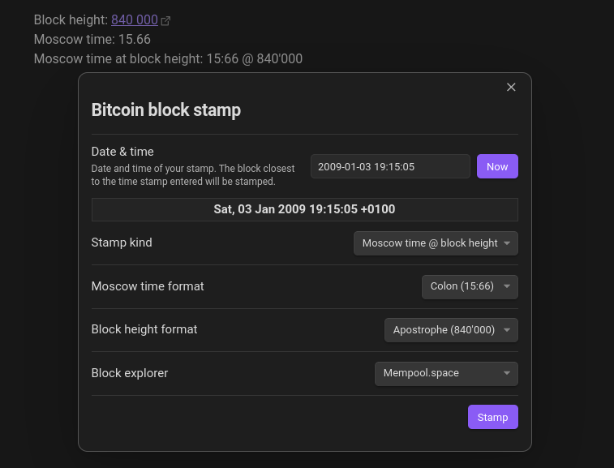

# Bitcoin Block Stamp for Obsidian

[![Version][badge-version]][gh-latest] [![License][badge-license]][gh-license] [![Obsidian downloads][badge-downloads]][obsidian-plugin]

Stamp your notes with the current Bitcoin block height, [Moscow time][moscowtime], or both. You can also stamp historical dates back to the Genesis block.

<div align="center">
  
</div>

## Features

- Insert current or historical block height.
- Insert current or historical Moscow time.
- Insert `Moscow time @ block height`.
- Optionally link block heights to a block explorer.
- Replace note placeholders such as `{{blockheight}}` when notes are created or by command.

## Usage

Use the Bitcoin ribbon icon or command palette commands:

- **Insert custom block stamp** — choose a date/time, stamp kind, format, and block explorer.
- **Insert current block height**
- **Insert current Moscow time**
- **Insert current Moscow time @ block height**
- **Replace stamp placeholders**

Default placeholders:

```text
{{blockheight}}
{{moscowtime}}
{{moscowtime@blockheight}}
```

You can change them in the plugin settings.

## Settings

- **Block explorer** — none, [Mempool.space][mempool-space], [Blockstream.info][blockstream-info], or [TimechainCalendar.com][timechaincalendar-com].
- **Block height format** — `840000`, `840,000`, `840.000`, `840 000`, `840'000`, or `840_000`.
- **Moscow time format** — `1566`, `15:66`, or `15.66`.
- **Stamp placeholders** — customize the text replaced by block height, Moscow time, and combined stamps.

## Installation

### Community plugin

Install **Bitcoin Block Stamp** from Obsidian's community plugin browser, then enable it.

### Manual install

Download `main.js`, `styles.css`, and `manifest.json` from the [latest release][gh-latest], then place them in:

```text
<Vault>/.obsidian/plugins/bitcoin-block-stamp/
```

Enable the plugin in `Settings > Community plugins > Installed plugins`.

## Data source

This plugin uses the [mempool.space REST API][mempool-space-api] for Bitcoin block and price data.

## Feedback

Open an [issue on GitHub][gh-issues] or reach me on [Nostr][me-njump].

[badge-version]:          https://img.shields.io/github/manifest-json/v/sfr0xyz/obsidian-bitcoin-block-stamp?style=flat-square&color=007ec6
[badge-license]:          https://img.shields.io/github/license/sfr0xyz/obsidian-bitcoin-block-stamp?style=flat-square&color=5D8211
[badge-downloads]:        https://img.shields.io/badge/dynamic/json?url=https%3A%2F%2Fraw.githubusercontent.com%2Fobsidianmd%2Fobsidian-releases%2Fmaster%2Fcommunity-plugin-stats.json&query=%24%5B%22bitcoin-block-stamp%22%5D.downloads&style=flat-square&logo=obsidian&label=downloads&color=7c3aed
[obsidian-plugin]:        https://obsidian.md/plugins?id=bitcoin-block-stamp
[gh-latest]:              https://github.com/sfr0xyz/obsidian-bitcoin-block-stamp/releases/latest
[gh-license]:             https://github.com/sfr0xyz/obsidian-bitcoin-block-stamp/blob/master/LICENSE
[gh-issues]:              https://github.com/sfr0xyz/obsidian-bitcoin-block-stamp/issues
[moscowtime]:             https://archive.is/I8oGK
[mempool-space]:          https://mempool.space
[mempool-space-api]:      https://mempool.space/docs/api/rest
[blockstream-info]:       https://blockstream.info
[timechaincalendar-com]:  https://timechaincalendar.com
[me-njump]:               https://njump.me/npub19a6x8frkkn2660fw0flz74a7qg8c2jxk5v9p2rsh7tv5e6ftsq3sav63vp
