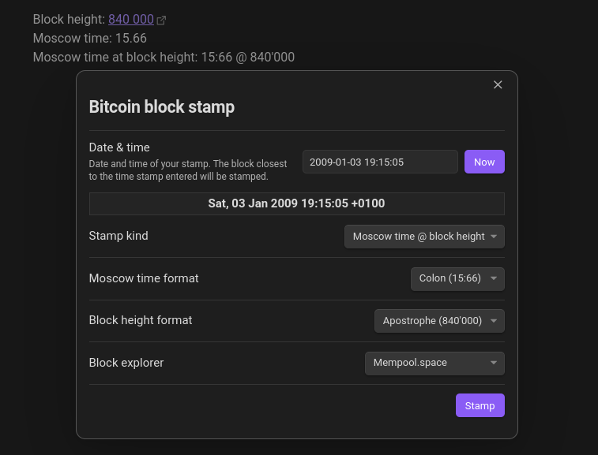

# Bitcoin Block Stamp for Obsidian

![Version][version-badge] ![License][license-badge] ![Obsidian downloads][downloads-badge]

Stamp your notes with the Bitcoin block height and Moscow time. Add the latest stamp or the stamp for any time in the past up to the Genesis block.

<div align="center"> <!-- TODO: update demo image -->
  
</div>

## Features

- Insert the latest or custom block height.
- Insert the latest or custom [Moscow time](https://thebitcoinmanual.com/btc-culture/glossary/moscow-time/).
- Insert the latest or custom "Moscow time @ block height", the [Moscow Time Bot](https://njump.me/npub1030jfcwftah37a242jv0qqvmuyje5ew8tt59rs3477c4e8ugurhqzdwcta) format.
- Add a link to your preferred block explorer for the block height.
- Display the block height and Moscow time in your preferred formats.
- Use stamp placeholders.

## Usage

After you successfully [installed and enabled](#installation) the plugin, you should see a Bitcoin icon in the sidebar.

- The icon opens a window which lets you add a custom stamp. Make sure you are in the editor mode to be able to insert the stamp.
  1. Enter the date and time you wish the closest block height or Moscow time for.
  2. Choose the stamp kind, format, and block explorer.
  3. Select **Stamp** to insert the stamp at your current curser position.
- You can also open this window via the command view `Ctrl + P`. Search for "_Bitcoin Block Stamp: Insert custom block stamp_".
- In the command view `Ctrl + P` you can also quick insert the latest block height / Moscow time / "Moscow time @ block height". Search for "_Bitcoin Block Stamp_".
<!-- TODO: add stamp placeholder usage guide -->

## Settings

- **Block explorer**: Select your preferred block explorer (or none).\
The block height stamp gets inserted as a Markdown link to corresponding block in your selected block explorer. At this time, the [Mempool.space](https://mempool.space), [Blockstream.info](https://blockstream.info), and [TimechainCalendar.com](http://timechaincalendar.com) are supported.
- **Formats**
  - **Block height format**: Select your preferred block height format.\
  You can choose between plain (840000), comma (840,000), period (840.000), space (840 000), apostrophe (840'000), and underscore (840\_000).
  - **Moscow time format**: Select your preferred Moscow time format.\
  You can choose between plain (1566), colon (15:66), and period (15.66).
- **Stamp placeholders**
  - **Block height placeholder**: Set the text which will be replaced with the block height.
  - **Moscow time placeholder**: Set the text which will be replaced with the Moscow time.
  - **Moscow time @ block height placeholder**: Set the text which will be replaced with the "Moscow time @ block height".

## Third-party sources

This plugin uses the [mempool.space REST API](https://mempool.space/docs/api/rest) to get the Bitcoin blockchain and price data.

## Installation

### In Obsidian

1. Go to `Settings > Community plugins > "Browse" community plugins`, and search for "_Bitcoin Block Stamp_".

2. Select **Install** and after successful installation select **Enable**.

3. You should now see _Bitcoin Block Stamp_ under _Community plugins_ in your settings.

### Manually

1. Download the release files from the [latest release](https://github.com/sfr0xyz/obsidian-bitcoin-block-stamp/releases/latest).

2. Go to the plugins subdirectory in your vault directory `<VAULT_DIRECTORY>/.obsidian/plugins/`.

3. Create a new directory called "bitcoin-block-stamp" and copy and paste the the downloaded `main.js`, `styles.css`, and `manifest.json` files into it.

You should now have the files `main.js`, `styles.css`, and `manifest.json` in your vault at `<VAULT_DIRECTORY>/.obsidian/plugins/bitcoin-block-stamp/`.

4. Go to your Obsidian vault and enable the plugin by toggling _Bitcoin Block Stamp_ under `Settings > Community plugins > Installed plugins`.

## Thank you

Thank you for using this plugin!

Your feedback is very much appreciated. If you have a feature idea or found a bug you can tag me on [nostr](https://njump.me/npub19a6x8frkkn2660fw0flz74a7qg8c2jxk5v9p2rsh7tv5e6ftsq3sav63vp) or open an [issue on GitHub](https://github.com/sfr0xyz/obsidian-bitcoin-block-stamp/issues).

If you like this plugin and want to support me, you can send me some sats via the Bitcoin Lightning Network. Visit my [Alby page](https://getalby.com/p/sefiro) or zap me on [nostr](https://njump.me/npub19a6x8frkkn2660fw0flz74a7qg8c2jxk5v9p2rsh7tv5e6ftsq3sav63vp).

Lightning Address:

```plaintext
sefiro@getalby.com
```

---

<div align="center">
Find me on nostr <a href="https://njump.me/npub19a6x8frkkn2660fw0flz74a7qg8c2jxk5v9p2rsh7tv5e6ftsq3sav63vp">@sefiro</a>
<p><code>npub19a6x8frkkn2660fw0flz74a7qg8c2jxk5v9p2rsh7tv5e6ftsq3sav63vp</code></p>
</div>

[version-badge]: https://img.shields.io/github/manifest-json/v/sfr0xyz/obsidian-bitcoin-block-stamp?style=flat-square
[license-badge]: https://img.shields.io/github/license/sfr0xyz/obsidian-bitcoin-block-stamp?style=flat-square
[downloads-badge]: https://img.shields.io/badge/dynamic/json?url=https%3A%2F%2Fraw.githubusercontent.com%2Fobsidianmd%2Fobsidian-releases%2Fmaster%2Fcommunity-plugin-stats.json&query=%24%5B%22bitcoin-block-stamp%22%5D.downloads&style=flat-square&logo=obsidian&label=downloads&color=7c3aed
